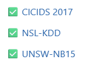

# 1.Explainable Deep Learning for Skin Disease Classification Using Visual and Textual Interpretability
### dataset:HAM10000: 
                      10,000 dermatoscopic images of skin lesions (7 classes)
                      ISIC Archive: Large set of skin lesion images.
                      PH2 Dataset

### Novelty Options:
Combine visual heatmaps with natural language explanations to enhance trust in AI.

Apply multilingual textual justification (Bengali/English).

Compare multiple XAI methods (Grad-CAM, LIME, SHAP).

Optimize for mobile deployment for use in low-resource clinics.

# 2.CV: Sign language to text(bangla)
# 3.CV: mental health analysis with academic data/social data 
# 4.AI-Based Intrusion Detection System using Network Traffic
### dataset:

✅ CICIDS 2017
✅ NSL-KDD
✅ UNSW-NB15